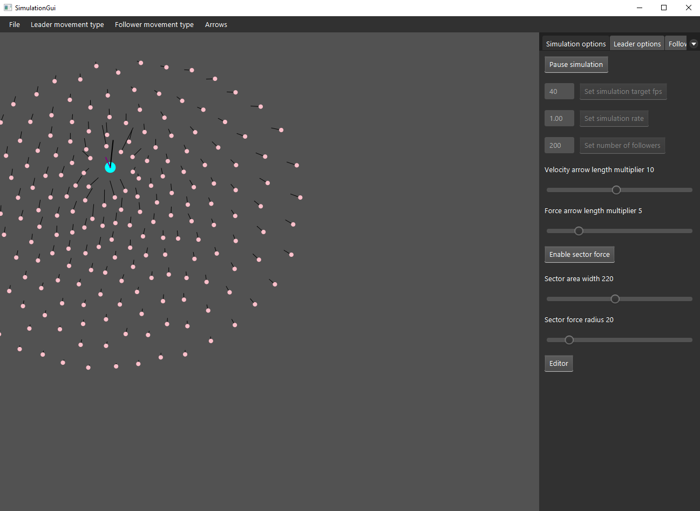
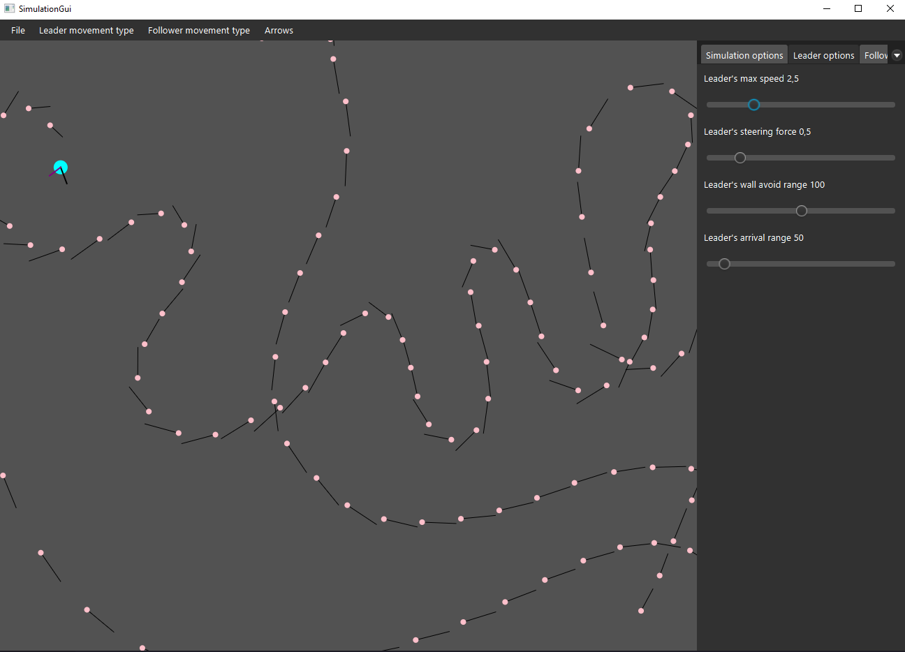
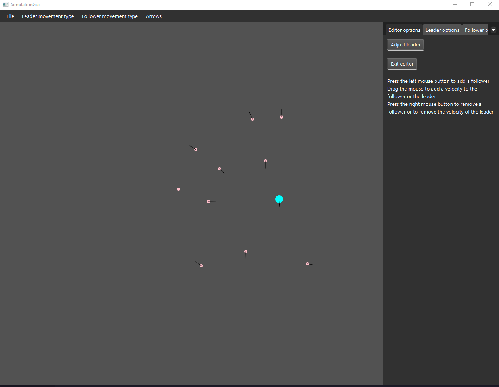

# Follow The Leader
Simulation based on the paper "Steering Behaviors For Autonomous Characters" by Craig W. Reynolds

Paper: http://www.red3d.com/cwr/steer/gdc99/

This simulation was made as a university course project

## Summary
In the simulation a leader is followed by followers. The followers avoid getting in the way of the leader and hitting the leader. The leader moves according to the chosen movement type. There are many different modes and variables to how the leader and followers act and how well they perform in their tasks.

The program has a user interface made with Scala Swing. The program can read a simulation state from a csv file and has an editor that can be used to create csv files for different simulation states. 

The calculations of the followers have been parallelised for better performance especially with big numbers of followers. 

## Pictures of the progam
The default view

One of the modes where followers follow the leader

The editor view
